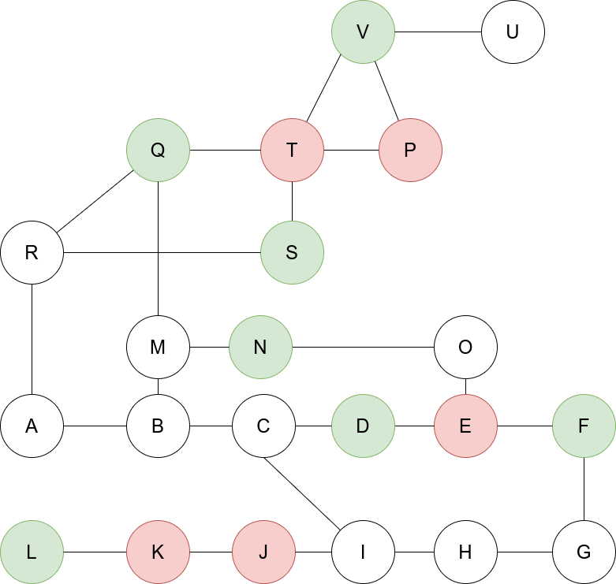

# Postulación a [Buda.com](https://www.buda.com/chile) - Vicente Merino

## Prerequisitos

Instalar [python 3](https://www.python.org/downloads/) o superior
Es necesario instalar pytest (usar [virtualenv](https://virtualenv.pypa.io/en/latest/) es recomendable). Luego instalar la librería `pytest`:

```
pip install pytest
```

o bien

```
pip install -r requirements.txt
```

## Formato de la red:

El formato de las red vienen dados en los archivos dentro de la carpeta `src/json/`, donde se usa el estándar json para describir la red de la siguiente forma:

```json
{
  "stations": ["A", "B", "C"],
  "edges": [["A", "B"], ["B", "C"]]
}
```

Es decir, `"stations"` debe incluir una lista con los nodos (estaciones) de la red, cada uno representado como un `string` y `"edges"` es una lista de listas con las relaciones, es decir si dos estaciones `"A"` y `"B"` están conectadas, la la lista de `"edges"` incluye el elemento `["A", "B"]` (o también puede ser `["B", "A"]`).

En la carpeta `src/json/` se pueden encontrar dos archivos con el formato descrito, en primer lugar el archvio `metro_buda.json` que representa la red de ejemplo del enunciado y en segundo lugar el archivo `metro.json` que viene a representar una red más grande, representada por el siguiente diagrama:



## Uso del programa

En primer lugar, es necesario colocarse en la carpeta `src`:

```
cd src
```

Luego, el programa se puede ejecutar desde una consola con el comando

```python main.py <path a archivo de red> <nombre de estación inicial> <nombre de estación final> <color de bus green/red (opcional)>```

Ejemplo:

```
python main.py json/metro.json U G red
```

Notar que el programa en general toma en cuenta varios posibles casos de errores (un color incorrecto, un nodo que no se encuentre definido en el archivo, etc.), en cuyo caso levatará una excepción.

## Testing

Se incluyeron varios tests automáticos utilizando la librería `pytest`, entre los cuales se encuentran, tests para la construcción de la red, ejecución del algoritmo y levantamiento de excepciones. Para probarlo, primero es necesario estar en la carpeta `src/`:

```
cd src
```

Y luego ejecutar:

```
pytest
```

## Script shell

Se crearon dos archivos de `.sh` (script shell), para ejecutar todos los posibles casos para ambas redes, es decir, ejecutar el algoritmo para cada par de estaciones, para cada tipo de color de un bus, y de esta forma es posible ver que el algoritmo siempre termina. Para ejecutar esto, es necario estar en la carpte `src/sh/`:

```
cd src/sh/
```

Luego, hay que dar permisos a ambos archivos, según el SO de preferencia y para ejecutarlos hay que escribir:

```
./run_all_metro.sh
./run_all_metro_buda.sh
```

Dado que  el output es muy grande, es posible mandarlo a un archivo `.txt`:

```
./run_all_metro.sh > output_metro.txt
./run_all_metro_buda.sh > output_metro_buda.txt
```
